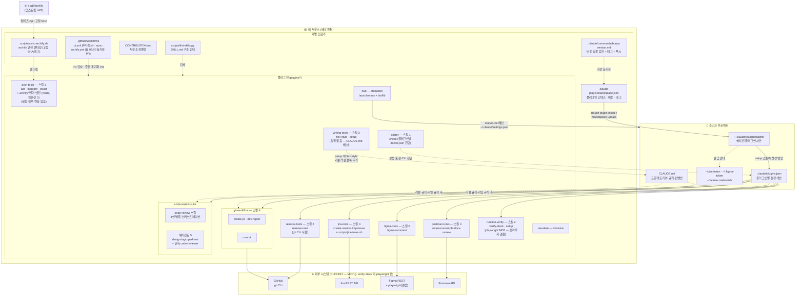
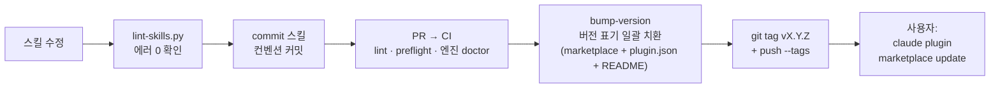
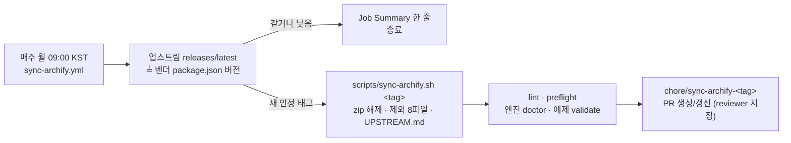

# okep-butler 마켓플레이스 구조

> 이 저장소(Claude Code 플러그인 마켓플레이스)의 전체 구조와 배포·소비 흐름.
> 기준: v1.3.0 (2026-09-23)

## 전체 구조

## 배포 파이프라인

archify 엔진은 별도 궤도로 갱신된다. 사람은 리뷰·머지만 한다:

## 구성요소 설명

| 구성요소 | 역할 | 비고 |
|----------|------|------|
| `marketplace.json` | 플러그인 인덱스 — 이름·경로·버전·태그 | 버전은 전 플러그인 단일 버전 정책 |
| `plugins/*/skills/*/SKILL.md` | 스킬 본체 (모델이 읽는 지침) | `when_to_use`로 자동 호출 조건 명시 |
| `plugins/*/skills/*/reference/` | `--help` usage 등 온디맨드 로드 문서 | 컨텍스트 절약용 점진 공개 |
| `plugins/*/agents/*.md` | 서브에이전트 시스템 프롬프트 | code-review-suite만 보유 (5개) |
| setup 스킬 (플러그인별) | `.claude/plugins.json` 섹션 생성/병합 + 토큰 안내 | visualize·arch-tools·doctor 제외 전 플러그인 제공 |
| `.claude/plugins.json` (소비자) | 플러그인별 설정 — ID·경로 등 비밀 아닌 값 | gitignore 대상, 토큰은 `*File` 경로로 분리 |
| `CLAUDE.md` (소비자) | 팀 공유 규칙 — 리뷰 규칙·커밋 규칙 | 스킬들이 훅으로 참조 (설정보다 우선순위 낮음) |
| `scripts/lint-skills.py` | 프론트매터·구조·MCP 표기 검사 | 에러 시 릴리즈 차단, 경고는 무방 |
| `bump-version` 커맨드 | 버전 치환 → README 동기화 → 태그 → 푸시 | 이 저장소 전용 (.claude/commands) |
| `plugins/arch-tools/archify/` | 벤더링된 archify 엔진 (Node CLI·렌더러·뷰어 템플릿·스키마) | `struct` 스킬이 호출. 손으로 고치지 않음, 출처는 `UPSTREAM.md` |
| `scripts/sync-archify.sh` | 업스트림 태그/SHA 를 받아 배포 파일만 벤더 디렉터리로 동기화 | 예제 HTML·업데이트 체커 제외, 네트워크 호출 0 |
| `.github/workflows/ci.yml` | PR·main 푸시마다 lint · preflight · 엔진 검증 | 저장소의 유일한 CI |
| `.github/workflows/sync-archify.yml` | 매주 월 09:00 KST 업스트림 안정 태그 확인 → 동기화 PR 자동 생성 | Actions 의 PR 생성 권한 설정 필요 |

## 설계 특징

- **MCP 최소화** — 외부 연동은 CLI(gh)·REST API 로 한다. 예외는 `runtime-verify` 의 `verify-stack`(playwright MCP — 기능 자체가 브라우저 검증) 한 곳. 설치 장벽 최소화
- **설정의 소유 분리** — 각 플러그인이 자기 setup으로 자기 섹션만 관리. 통합 setup-all 없음
- **지식과 행동의 분리** — 스킬/에이전트는 절차·출력 계약·팀 우선순위만 담고, 도메인 지식(무엇이 문제인가)은 모델 판단에 위임. 스택별 체크리스트 하드코딩 금지 (v3.0.0-M1에서 확립)
- **없으면 기본값** — 설정 키 부재 = 기본 동작. placeholder 뼈대 생성 금지 (jq 파싱 스크립트가 가짜 값을 실제 값으로 오인하는 사고 방지)

## 파일 위치 참조

| 경로 | 내용 |
|------|------|
| `.claude-plugin/marketplace.json` | 마켓플레이스 인덱스 |
| `plugins/<name>/.claude-plugin/plugin.json` | 플러그인 메타 (버전·설명·키워드) |
| `plugins/git-workflow/skills/` | commit, create-pr, dev-report, setup |
| `plugins/release-tools/skills/` | release-note, setup (gh CLI — 태그 간 diff 분석·GitHub Release 등록) |
| `plugins/arch-tools/skills/` | adr, diagram, struct (외부 연동 무관 — 코드 분석 → 문서·인터랙티브 HTML 생성) |
| `plugins/arch-tools/archify/` | 벤더링된 archify 엔진 + `UPSTREAM.md` (고정 SHA·제외 목록·재동기화 절차) |
| `scripts/sync-archify.sh` · `scripts/verify-archify-engine.sh` · `scripts/semver-newer.mjs` | 엔진 동기화·검증 도구 (CI 와 공유) |
| `.github/workflows/` | `ci.yml`, `sync-archify.yml` |
| `plugins/writing-tools/skills/` | flex-style, setup (플렉스 테크블로그 문체 규칙·발췌 reference + `~/.claude/CLAUDE.md` 지시 블록 배선) |
| `plugins/runtime-verify/skills/` | verify-stack, setup (이슈·브랜치별 포트 블록 기동 + 브라우저 검증) |
| `plugins/doctor/scripts/check.py` | 설치 플러그인 진단 (플러그인별 doctor.json 매니페스트 기반) |
| `plugins/code-review-suite/agents/` | design/logic/performance/test/code-reviewer |
| `plugins/jira-tools/scripts/jira-issue.sh` | Jira 이슈 생성 셸 스크립트 (jq 기반 설정 파싱) |
| `plugins/hud/launcher.mjs` | statusline 안정 런처 (`~/.claude/hud/`에 설치됨) |
| `scripts/lint-skills.py` | SKILL.md 린터 |
| `.claude/commands/bump-version.md` | 릴리즈 커맨드 |
